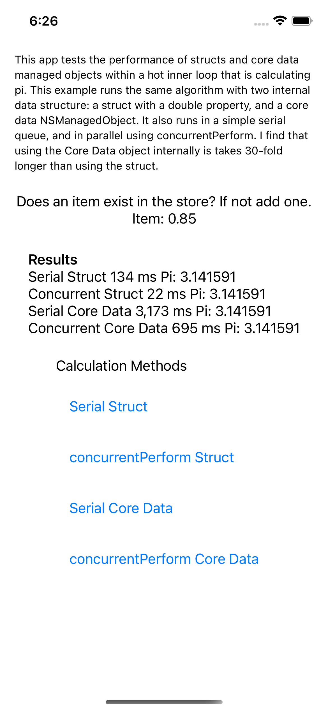

#  About

This app is an exploration of how to best use Core Data NSManagedObjects in high performance numerical code. I want to explore the performance of a NSManagedObject with a Double attribute in a hot loop, as compared to using a struct with a Double attribute.

In this test my "hot loop" is calculating the digits of Pi using the Gregory-Leibniz series. I'm running 500k iterations per calculation, and repeating each calculation 200 times per condition. The final value of pi for the 200th repetition is shown on screen.

I find that using a NSManagedObject for the inner loop results in 25-30 fold slower performance compared to using a struct. I'd be interested in any ideas you have for ways to mitigate this performance impact.

**NOTE** You will probably need to compile with the Profile scheme (as a Release) to get acceptable performance.

</img>

A side note on the architecture of this test app: I am prototyping the inner loop multithreading for another project. In this other project, a simulation will take a set of initial conditions (in the form of structs with behavior) and run many permuations based on the initial conditions. Only the initial conditions are user-set, and will be persisted. The transient values observed during the simulation will be discarded. For this reason, in this test app I create a background view context for the calculatePi function, which allows its inner NSManagedObject to change during the simulation without affecting the UI, and without being persisted between any of the 200 runs. In this test app the initial value of the passed NSManagedObject is not used, but in my other project it will be, so here I am prototyping the flow of data.

From this test I conclude that I should use Core Data only for the user configuration, and use those to instantiate structs which will be used in the simulation.
